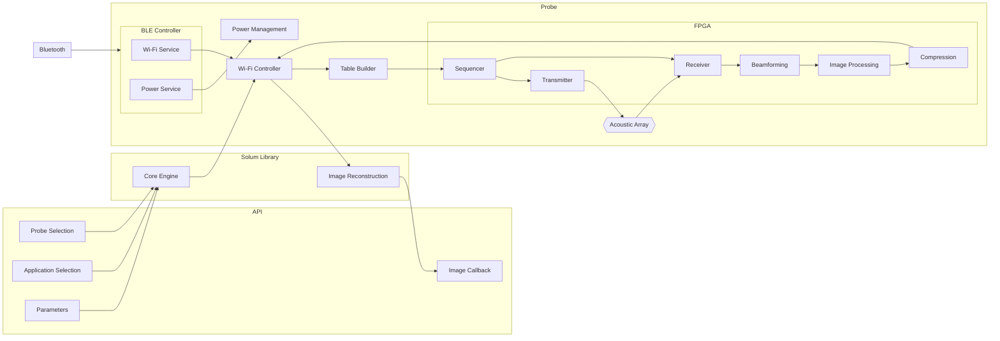

# General Design Block Diagram

```mermaid
flowchart LR
  prb-->core
  app-->core
  prms-->core
  ir-->cb
  bluetooth-->ble
  core-->wf
  wf-->ir
  cmp-->wf

  subgraph API
    prb[Probe Selection]
    app[Application Selection]
    prms[Parameters]
    cb[Image Callback]
  end

  subgraph Solum Library
    core[Core Engine]
    ir[Image Reconstruction]
  end
    
  subgraph probe[Probe]
    build[Table Builder]
    seq[Sequencer]
    wf[Wi-Fi Controller]
    pow[Power Management]
    wf-->build
    build-->seq
    wis-->wf
    pws-->pow
    subgraph ble[BLE Controller]
      pws[Power Service]
      wis[Wi-Fi Service]
    end
    subgraph fpga[FPGA]
      direction LR
      seq[Sequencer]
      ip[Image Processing]
      bf[Beamforming]
      tx[Transmitter]
      rx[Receiver]
      cmp[Compression]
      seq-->tx
      seq-->rx
      rx-->bf
      bf-->ip
      ip-->cmp
    end
    stack{{Acoustic Array}}
    tx-->stack
    stack-->rx
  end

  subgraph bluetooth[Bluetooth]
    
  end
    
```
