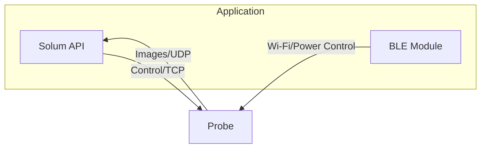

# Solum Specifications

## Introduction

Solum is a software development kit (SDK) that allows for 3rd party medical device companies to create their own software and mobile applications for use with the Clarius suite of wireless handheld ultrasound scanners.

## Architecture

The API communicates with the Clarius probe directly, and makes use of TCP/UDP technologies to create and maintain the wireless connection to the probe.
Bluetooth communications is not built directly into the API and thus must be written by the developer using the library/platform of their choice.



# Performance Specifications

## Scanners

The following probes are supported for use within the Solum SDK.

First Generation Scanners

* C3-45
* L7-38
* C7-20
* EC7-10

HD Scanners

* C3HD
* PA2HD
* L7HD
* L15HD
* L20HD
* C7HD
* EC7HD
* LDENHD

HD3 Scanners

* C3HD3
* PA2HD3
* L7HD3
* L15HD3
* L20HD3
* C7HD3
* EC7HD3

## Applications

Applications will vary among specific probe models.

* Abdomen
* Bladder
* Breast
* Cardiac
* Dental
* IVF
* Lung
* Musculoskeletal
* Musculoskeletal Advanced (Ankle, Elbow, Hip, Knee, Shoulder, Spine, Hand/Wrist)
* Nerve
* Obstetrics
* Obstetrics Early
* Ocular
* Pelvic
* Prostate
* Small Organs
* Superficial
* Transcranial
* Vascular

## Imaging Modes

Imaging modes will vary among specific probe models and applications.

The following imaging modes are currently supported through the API:

* B-mode
  * Base grayscale imaging for the majority of use cases
* Spatial Compounding
  * Multi-frame grayscale acquisition to enhance certain anatomy and smooth the image
* M-Mode
  * Greyscale time-based spectrum acquisition for measuring heart rate
* Color Doppler
  * Directional flow information that is overlaid on the grayscale image
* Power Doppler
  * Similar to color Doppler, but without directional information, showing just the power (relative intensity) of the flow
* Pulsed Wave Doppler
  * Time-based spectral acquisition for visualizing and quantifying blood speed and direction
* Needle Enhance
  * Multi-frame grayscale acquisition that will try and highlight an in-plane needle shaft when detected through special algorithms
* Strain Elastography
  * Acquires multiple frames for analysis of relative stiffness amongst tissue within a given view
* RF Mode
  * Raw radiofrequency signals interleaved with grayscale frames

## Parameter Controls

Much of the way the architecture works is to automatically optimize the image based on preset and depth selections, however various parameters are offered as inputs for finer control over imaging, which include:

* Imaging Depth
  * Depth at which to acquire images at
* Gain/Brightness
  * Overall brightness of the image, adjusts a post-processing gamma curve
* Auto Gain
  * Option to use the automated gain algorithm for adjusting the analog circuitry over the depth of the image to normalize the tissue brightness
* TGC
  * Three sliders that control digital gain applied to the raw signal over the depth of the image
* Dynamic Range
  * Compression curve adjustment for a more or less contrast image
* Chroma
  * Colorized map to apply to the grayscale image
* Smooth
  * Option to change the smooth filtering
* Trapezoidal Imaging
  * Option to engage a wider field of view for linear array probes
* Color/Power ROI
  * The region of interest for obtaining the Doppler signal within the grayscale image
* Color/Power Gain
  * Analog gain adjustment for the Doppler signal
* Color/Power PRF
  * Velocity range adjustment for the Doppler signal
* Color/Power Steering Angle
  * Steering angle adjustment for optimizing flow profiles
* Color/Power Invert
  * Option to reverse the red and blue correlation to flow direction
* Pulsed Wave Doppler Gain
  * Analog gain adjustment for the Doppler signal
* Pulsed Wave Doppler PRF
  * Velocity range adjustment for the Doppler signal
* Pulsed Wave Doppler Steering Angle
  * Steering angle adjustment for optimizing flow profiles
* Needle Side
  * Option for changing the side for which the algorithm is analyzing the needle
* Strain Elastography ROI
  * The region of interest for obtaining the elastography signal within the grayscale image
* Strain Elastography Opacity
  * Opacity adjustment for visualizing the greyscale tissue underneath
* Eco Mode
  * Option for engaging a power saving mode while imaging
* RF ROI
  * The region of interest for obtaining the radiofrequency signal within the grayscale image

## Status Information

Retrievable status information from the probe includes:

* Battery level
* Temperature level
* Frame rate (if imaging)
* Fan status
  * Attached
  * Detached
  * Running
* Charging status

## Probe Information

Retrievable probe characteristics include:

* Hardware version
* Number of elements
* Element pitch
* Radius (if applicable)

## Probe Settings

Internal persistent probe settings can be programmed, which include:

* Timeouts
  * Contact detection
  * Auto freeze
  * Keep awake
  * Deep sleep
  * Stationary detection
* Flags
  * Wi-Fi optimization
  * Wi-Fi search
  * HT40 Wi-Fi
  * Charging keep awake
  * Power button enable
  * Sounds enable
  * Wake on shake
* Button Programming
  * Up setting
  * Down setting
  * Up hold setting
  * Down hold setting

# Connectivity

Bluetooth low energy (BLE) 4.1 is used for communicating with the probe when in a low power state and specific BLE services can be interrogated for querying status or communicating with the device.

Custom BLE services include:

* Power Service (PWS) (UUID 0x8C853B6A-2297-44C1-8277-73627C8D2ABC)
  * Power Published Characteristic (UUID 0x8C853B6A-2297-44C1-8277-73627C8D2ABD)
  * Power Request Characteristic (UUID 0x8C853B6A-2297-44C1-8277-73627C8D2ABE)
* Wi-Fi Information Service (WIS) (UUID 0xF9EB3FAE-947A-4E5B-AB7C-C799E91ED780)
  * Wi-Fi Published Characteristic (UUID 0xF9EB3FAE-947A-4E5B-AB7C-C799E91ED781)
  * Wi-Fi Request Characteristic (UUID 0xF9EB3FAE-947A-4E5B-AB7C-C799E91ED782)

Other standard BLE services that the probe offers include:

* Battery Service
  * For interrogating battery level of the probe
* Health Temperature Service
  * For interrogating temperature level of the probe
* Device Information Service
  * For retrieving information such as serial number, model type, and various software/firmware versions
* Immediate Alert Service
  * For sending an alert to the probe for physical discovery purposes

## Power Service

The __PWS__ is a custom service built by clarius to read and manage the power status of the probe.

### Power Published Characteristic

Once ready, the device powered status will be published through the _Power Published_ characteristic, and can be read at any point after a BLE connection, as well as subscribed to, and thus a notification will take place when the information has changed. The read and notifications will always be 1 byte, with the following potential values:

* 0: Powered Off
* 1: Powered On
* 2: Cannot Boot - Low Battery
* 3: Cannot Boot - Too Warm
* 4: Cannot Boot - Other Error
* 5: Device Fully Booted (preparing/ready for Wi-Fi connection)

To subscribe to the Power Published characteristic, one can write 0100 to the characteristic's Client Characteristic Configuration Descriptor (CCCD), allowing the probe to send out notifications to the connected program.

### Power Request Characteristic

To power on or off the device, one can write to the _Power Request_ characteristic. Writing 0x00 to the characteristic will power the device off, and writing 0x01 will power the device on.

## Wi-Fi Information Service

The __WIS__ is a custom service built by Clarius to read and manage the Wi-Fi network once the probe is powered up and ready. A probe is typically in a ready state when the LED has stopped flashing and is solid blue. The service data is published and written in [YAML](https://yaml.org).

### Wi-Fi Published Characteristic

Once ready, the current Wi-Fi network information will be published through the _Wi-Fi Published_ characteristic, and can be read at any point after a BLE connection, as well as subscribed to, and thus a notification will take place when the information has changed. If the service reads "N/A", it typically means the probe has not finished booting to a ready state.

To subscribe to the Wi-Fi Published characteristic, one can write 0100 to the characteristic's Client Characteristic Configuration Descriptor (CCCD), allowing the probe to send out notifications to the connected program.

The read back text from the characteristic is in YAML format (note that strings may or may not have quotes).

If the probe is still booting up and the Wi-Fi network is not yet ready:

```
state: disabled
```

If the Wi-Fi network is in AP mode and ready for connection:

```
state: connected
ap: true
ssid: DIRECT-<probe serial number>
pw: <probe network password>
ip4: 192.168.1.1
ctl: <control port>
cast: <casting port>
avail: <'available' if available for control, 'listen' if available for casting, 'not available' if not available for any connection>
channel: <wifi channel>
mac: <mac address>
```

Note that the password will only be sent if the network used is the probe's own Access Point (AP). If connected to a router, the password will not be sent as it is assumed that the credentials are managed elsewhere.

### Wi-Fi Request Characteristic

To change network configurations, one can write to the _Wi-Fi Request_ characteristic. Note that the probe must be in a ready state before the request will have any effect.

To put the probe on its internal access point, simply send:

```
ap: true
ch: <'auto' or channel number>
```

To request to put the probe on a router (or any other external network), write to the characteristic in the following format:

```
ap: false
ssid: <network SSID>
password: <network password>
```

Once the probe has joined or launched the Wi-Fi network, the published characteristic will be subsequently written.

# Authentication

The Solum API requires the probe be authenticated once a connection has been made, otherwise loading applications, firmware updates, and imaging cannot be performed. Clarius Cloud offers a new mechansim for retrieving authentication certificates for each probe.

The first step is to generate a token which will allow software to access a dedicated endpoint. These tokens should be treated securely, as they essentially provide similar credentials to a user login. To generate a new token:

* Login to Clarius Cloud with an Administrator account
* Go to **Institution Settings**
* Choose **Policies** from the menu
* Choose **OEM API Keys**
* Choose **Add New Key**
* Store that key somewhere safe

Keys can also be revoked through the same interface. If you feel your token was compromised, revoking, creating a new key, and then issuing a security update for your software is the proper pathway to address the situation.

Valid tokens should be used to access a the [REST API endpoint](https://cloud.clarius.com/api/public/v0/devices/oem/) built for certificate (and other meta data) retrieval for each probe within your institution. Only "oem" licensed probes will have a certificate attached.

# Firmware Updates

Imaging with a probe through Solum requires that the firmware versions match in order for the protocols to function properly. Querying the internal version of the API is possible, as is updating the probe's firmware with the built-in binaries that are required.

# Platform Support

The platforms the SDK has been deployed and tested with include:

* Windows 10
  * x86/64
* Linux
  * Ubuntu 20.04
  * Ubuntu 22.04
* macOS 10.15 or higher
* iOS 13 or higher
* Android 10 or higher
